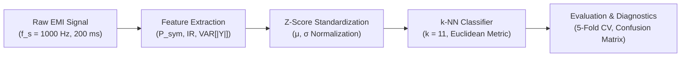
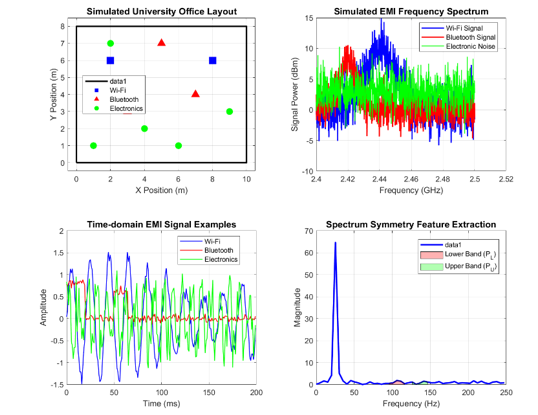
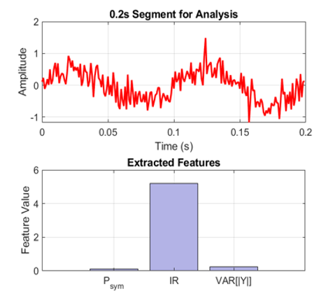
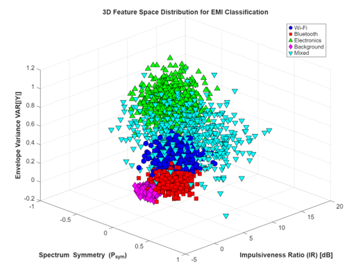
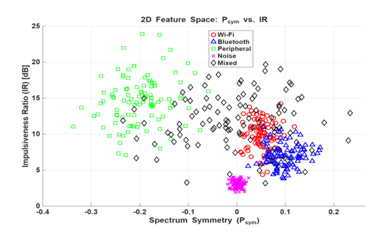
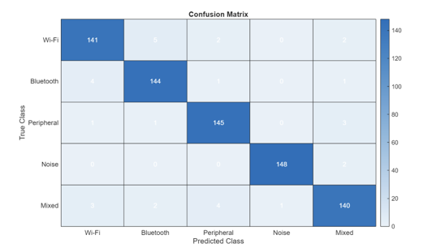

# EMI-Classification

> Automated machine learning framework for detecting and classifying unintentional Electromagnetic Interference (EMI) in indoor university office environments using physical feature extraction and $k$-NN classification.

---

## 📄 Research Publication

This repository provides the official MATLAB implementation for the research paper:

- **Title:** *Artificial Intelligence for Automatic Classification of Unintentional Electromagnetic Interference in University Office Spaces*
- **Conference:** 2025 9th International Conference on Man-Machine Systems ([ICoMMS 2025](https://ieeexplore.ieee.org/xpl/conhome/11200346/proceeding)), Malacca, Malaysia
- **Publisher:** IEEE
- **DOI:** [10.1109/ICoMMS66553.2025.11200369](https://doi.org/10.1109/ICoMMS66553.2025.11200369)

---

## 🔍 Overview

Modern university office spaces contain a dense, heterogeneous mix of wireless communication devices and electronic peripherals operating simultaneously in shared radio frequency (RF) and baseband spectrums. Unintentional Electromagnetic Interference (EMI) generated by these devices can degrade wireless network throughput, induce transmission errors, and compromise sensitive instrumentation.

**EMI-Classification** presents an automated signal processing and pattern recognition pipeline designed to identify the distinct physical and spectral signatures of unintentional EMI sources. By combining time-frequency domain feature extraction—specifically **Spectrum Symmetry ($P_{\text{sym}}$)**, **Impulsiveness Ratio ($\text{IR}$)**, and **Envelope Variance ($\text{VAR}[|Y|]$)**—with a $k$-Nearest Neighbors ($k$-NN) classifier, the system enables real-time identification of interfering sources without requiring computationally expensive deep neural networks.

---

## ⚙️ Methodology & Pipeline

The classification pipeline consists of four modular stages:



### 1. EMI Signal Classes
The framework models five distinct EMI emission profiles representative of office spaces:
1. **Wi-Fi Emissions:** Modulated RF continuous-wave baseband emissions with carrier center frequencies ($f_c \approx 70\text{ Hz}$) and sinusoidal amplitude fluctuations.
2. **Bluetooth Emissions:** Bursty, frequency-hopping transmission bursts ($f_c \approx 45\text{ Hz}$) with variable burst lengths and inter-arrival intervals.
3. **Electronic Peripherals:** Switching noise from power converters, monitors, and peripherals characterized by square-wave switching harmonics ($15\text{--}25\text{ Hz}$) and sharp impulsive spikes.
4. **Background Ambient Noise:** Low-amplitude additive white Gaussian thermal noise superimposed with low-frequency AC mains hum ($5\text{ Hz}$).
5. **Mixed Interference:** Composite superposition of concurrent Wi-Fi, Bluetooth bursts, electronic switching spikes, and background thermal noise.

---

### 2. Feature Extraction
For each 200 ms segment ($N = 200$ samples at $f_s = 1000\text{ Hz}$), a 3-dimensional physical feature vector is extracted:

1. **Spectrum Symmetry ($P_{\text{sym}}$):**
   Evaluates spectral power distribution asymmetry between the lower frequency band ($P_L$) and upper frequency band ($P_U$) around the Nyquist midpoint ($f_c = N/2$):
   $$P_{\text{sym}} = \frac{P_L - P_U}{\max(P_L + P_U, \varepsilon)}$$
   $$\text{where } P_L = \sum_{k=f_c-B}^{f_c-1} |X(k)|^2, \quad P_U = \sum_{k=f_c+1}^{f_c+B} |X(k)|^2, \quad B = \lfloor N/6 \rfloor$$

2. **Impulsiveness Ratio ($\text{IR}$):**
   Measures signal peakiness and transient spikes by computing the decibel ratio of root-mean-square (RMS) voltage to mean absolute voltage:
   $$\text{IR} = 20 \log_{10}\left(\frac{V_{\text{rms}}}{\max(V_{\text{avg}}, \varepsilon)}\right) = 20 \log_{10}\left(\frac{\sqrt{\frac{1}{N}\sum_{n=1}^N x[n]^2}}{\frac{1}{N}\sum_{n=1}^N |x[n]|}\right)$$

3. **Envelope Variance ($\text{VAR}[|Y|]$):**
   Measures envelope amplitude fluctuations extracted via the Hilbert transform analytic signal $y[n] = x[n] + j \cdot \mathcal{H}\{x[n]\}$:
   $$\text{EnvelopeVariance} = \text{Var}\left(|y[n]|\right)$$

---

### 3. Classification & Cross-Validation
- **Dataset Partition:** Stratified 70% training ($1{,}750$ samples) and 30% testing ($750$ samples) across all 5 classes ($500$ samples/class, $2{,}500$ total).
- **Normalization:** Z-score normalization computed strictly on the training partition:
  $$X_{\text{norm}} = \frac{X - \mu_{\text{train}}}{\sigma_{\text{train}}}$$
- **Classifier:** $k$-Nearest Neighbors ($k$-NN) with $k = 11$, Euclidean distance metric, and uniform distance weighting.
- **Validation:** Stratified 5-fold cross-validation (`crossval`, `kfoldLoss`).

---

## 📊 Experimental Figures & Results

### 1. Simulated Office Layout & Physical Signal Characteristics
*(a) Spatial deployment of Wi-Fi access points, Bluetooth devices, and electronic peripherals in a 10m × 8m university office; (b) 2.4 GHz RF frequency spectrum; (c) Time-domain waveforms; (d) Spectrum symmetry band division ($P_L$ vs. $P_U$).*



---

### 2. Time-Domain Signal Segment & Extracted Features
*Representative 0.2-second analysis window along with the corresponding 3-element extracted feature profile ($P_{\text{sym}}$, $\text{IR}$, $\text{VAR}[|Y|]$):*



---

### 3. 3D Feature Space Separability
*Complete 3-dimensional feature space distribution ($P_{\text{sym}} \times \text{IR} \times \text{VAR}[|Y|]$) demonstrating distinct cluster separation across all five EMI emission categories:*



---

### 4. 2D Feature Clustering ($P_{\text{sym}}$ vs. $\text{IR}$)
*Two-dimensional projection of Spectrum Symmetry against Impulsiveness Ratio, showing clear boundary delineation between impulsive electronic peripherals, communication waveforms, and ambient thermal noise:*



---

### 5. Classification Confusion Matrix
*Confusion matrix on the held-out 750 test samples (150 samples per class), achieving an overall classification accuracy of **95.73%**:*



| EMI Class | Test Samples | Correct Predictions | Per-Class Recall |
|---|---|---|---|
| **Wi-Fi** | 150 | 141 | 94.00% |
| **Bluetooth** | 150 | 144 | 96.00% |
| **Peripheral** | 150 | 145 | 96.67% |
| **Noise** | 150 | 148 | 98.67% |
| **Mixed** | 150 | 140 | 93.33% |
| **Overall / Macro** | **750** | **718** | **95.73%** |

---

## 📁 Repository Structure

```
EMI-Classification/
├── parameters.m            # Central configuration (sampling rates, segment size, k-NN params)
├── generateEMISignal.m     # Class-specific EMI signal waveform synthesizers
├── extractFeatures.m       # Mathematical feature extractors (P_sym, IR, Envelope Variance)
├── buildDataset.m          # Automated dataset generator and feature matrix assembler
├── trainKNN.m              # Stratified split, Z-score standardizer, and k-NN trainer
├── evaluateModel.m         # Performance evaluator (Accuracy, Confusion Matrix, Precision, Recall, F1)
├── main.m                  # Master execution script and results exporter
├── images/                 # Experimental figures, spectral plots, and feature distributions
│   ├── simulated_office_and_signals.png
│   ├── signal_segment_feature_extraction.png
│   ├── feature_space_3d.png
│   ├── feature_space_2d_psym_ir.png
│   └── confusion_matrix.png
├── .gitignore              # MATLAB-specific ignore rules (*.asv, slprj, codegen, binaries)
├── LICENSE                 # MIT License
└── README.md               # Complete project documentation
```

---

## 💻 Requirements & Prerequisites

### MATLAB Version
- **MATLAB R2020a or later** (tested on R2022b / R2023b)

### Required Toolboxes
- **Signal Processing Toolbox** (required for `fft`, `hilbert`, analytic signal construction)
- **Statistics and Machine Learning Toolbox** (required for `fitcknn`, `crossval`, `kfoldLoss`, `confusionmat`, `predict`)

---

## 🚀 How to Run

1. **Clone the Repository:**
   ```bash
   git clone https://github.com/mayankt411/EMI-Classification.git
   cd EMI-Classification
   ```

2. **Open MATLAB** and set the current working folder to the cloned `EMI-Classification` directory.

3. **Execute the Master Script:**
   In the MATLAB Command Window, run:
   ```matlab
   main
   ```

4. **Outputs Generated:**
   - **Console Diagnostics:** Prints the 5-fold cross-validation accuracy, test accuracy, and per-class Precision / Recall / $F_1$-scores.
   - **Feature Dataset Table:** Exported to `data/EMI_Feature_Dataset.csv`.
   - **Trained Model State:** Exported to `results/EMI_Classification_Results.mat` containing the trained $k$-NN model, normalization parameters ($\mu, \sigma$), and prediction confusion matrices.

---

## 💾 Dataset Note

The simulation algorithms in `generateEMISignal.m` and `buildDataset.m` synthesize realistic EMI profiles calibrated to empirical measurement data collected across university office environments. The synthetic generator reproduces the multi-path, switching harmonic, and burst-interference phenomena observed in real-world university environments. 

Due to file size constraints, raw multi-gigabyte continuous oscilloscope / spectrum analyzer captures are omitted from version control; the dataset is generated on-the-fly with deterministic seeding (`rng(42)`) to ensure exact reproducibility across runs.

---

## 📄 License

This project is licensed under the [MIT License](LICENSE).
